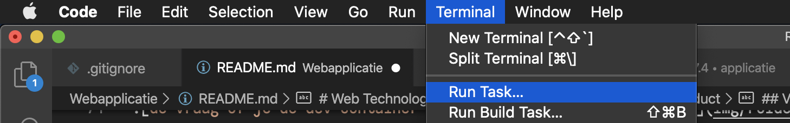
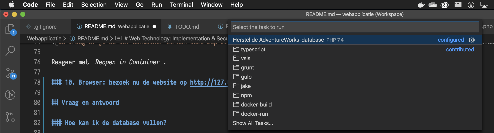

# Web Technology: Implementation & Security - Beroepsproduct

**Ontwikkel je mee aan dit project**? Zie de [workflow en richtlijnen](/.github/CONTRIBUTING.md).

## Inleiding

Dit is een startpunt voor je uitwerking van het beroepsproduct, een website gebaseerd op PHP en SQL Server. Dit project gaat uit van [Visual Studio (VS) Code](https://code.visualstudio.com/docs/getstarted/userinterface).

## Stappenplan voor start

Het is belangrijk dat je deze stappen exact in deze volgorde uitvoert om te kunnen beginnen met programmeren.

Voor een beginner zou dit eenmalig een kwartier kunnen duren. Vervolgens, als je alles weg zou gooien, maar met ervaring, 3 minuten.

### 0. Vereisten

- Installeer [VS Code](https://code.visualstudio.com/).
- Installeer Docker. Dit project is getest met de variant [Docker Desktop](https://www.docker.com/products/docker-desktop).

### 1. GitHub: Haal een kopie van dit project binnen

Dat kan op allerlei manieren. De gemakkelijkste is om het project als een ZIP-archief te downloaden.

Zie: [_Cloning a repository using the command line_](https://help.github.com/en/github/creating-cloning-and-archiving-repositories/cloning-a-repository#cloning-a-repository-using-the-command-line), alleen stap 3.

### 2. VS Code: open de workspace

Open het bestand [`/webapplicatie.code-workspace`](/webapplicatie.code-workspace) als workspace.
Zie: [_Opening workspace files_](https://code.visualstudio.com/docs/editor/multi-root-workspaces#_opening-workspace-files).

### 3. VS Code: installeer de benodigde extensies

Op een gegeven moment krijg je

Reageer met _Install All_.

### 4. VS Code: open een nieuw venster voor SQL Server 2019

Via de menubalk bovenaan: _File_ > _New Window_.

N.B.: Dit venster is en blijft specifiek om te ontwikkelen aan of te werken met SQL Server 2019.

### 5. VS Code: open de folder `rdbms` in het venster voor SQL Server 2019

Via de menubalk bovenaan: _File_ > _Open..._.
Select de map `rdbms`, dus niet een bestand erbinnen.

### 6. VS Code: activeer de dev container voor SQL Server 2019

Wacht rustig af tot VS Code in de blauwe balk onderaan geen activiteit meer vertoont. Dit kan de eerste keer tot ca. 10 minuten duren, afhankelijk van hoe snel je internetverbinding en computer is.

Op een gegeven moment krijg je

Reageer met _Reopen in Container_.

### 7. VS Code: open een nieuw venster voor PHP

Via de menubalk bovenaan: _File_ > _New Window_.

### 8. VS Code: open de folder `webserver` in het venster voor PHP

Via de menubalk bovenaan: _File_ > _Open..._. Selecteer de map `webserver`, dus niet een bestand erbinnen.

### 9. VS Code: activeer de dev container voor PHP

Neem ook hier de inleidende opmerking serieus bij de eerdere stap _... activeer de dev container voor SQL Server 2019_.

Op een gegeven moment krijg je

Reageer met _Reopen in Container_.

### 10. Browser: bezoek nu de website op http://127.0.0.1/over

## Vraag en antwoord

### Hoe kan ik de database vullen?

Getest is het herstellen van een `.bak`-bestand met een dump van de AdventureWorks-voorbeelddatabase.

### 1. Browser: download de database dump (eenmalig)

Download de [Adventure Works 2017](https://docs.microsoft.com/en-us/sql/samples/adventureworks-install-configure?view=sql-server-ver15) database dump vanaf https://github.com/Microsoft/sql-server-samples/releases/download/adventureworks/AdventureWorks2017.bak naar de map [`rdbms/`](/rdbms). Sla het bestand op onder de naam `AdventureWorks2017.bak`.

### 2. Herhaal het _stappenplan voor start_

Sluit VS Code helemaal af, en herhaal het stappenplan.

(N.B.: Alleen zodra je gevorderd bent in het omgaan met VS Code en dev containers kan je zelf een kortere weg bedenken.)

### 3. VS Code: start de task _Herstel de AdventureWorks-database_ in het venster voor PHP

Zorg ervoor dat je in het venster voor PHP bezig bent.

Kies Menubalk > _Terminal_ > _Run Task..._.

Kies vervolgens _Herstel de AdventureWorks-database_.

### Hoe kan ik dingen uitproberen en uitzoeken aan de database buiten PHP om?

In de dev container [SQL Server 2019](/rdbms/) staat de [SQL Server-extensie voor VS Code](https://docs.microsoft.com/en-us/sql/visual-studio-code/sql-server-develop-use-vscode?view=sql-server-ver15) standaard geïnstalleerd.

Ook kan je [SQL Server Management Studio (SSMS)](https://docs.microsoft.com/en-us/sql/ssms/download-sql-server-management-studio-ssms?view=sql-server-ver15) gebruiken.

## Ontwerp

Dit template gebruikt [de ingebouwde webserver van PHP](https://www.php.net/manual/en/features.commandline.webserver.php), omdat dat (1) voor een minder ingewikkelde opzet zorgt en (2) voldoende is voor deze onderwijsopdracht.
