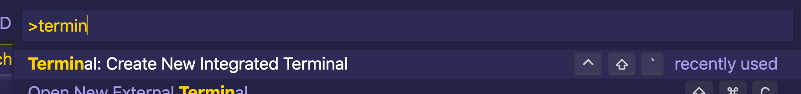

# Troubleshooting

Hier is een overzicht van wat dingen die in het proces beschreven in de README niet goed kunnen gaan.

- [Mijn Visual Studio Code laat geen venstertje zien over een zogenoemde 'dev container'](#geen-dev-container)
- [Mijn PHP container wil niet starten](#php-container-start-niet)

## Geen dev-container

Als je geen dev-container krijgt kan je het even proberen met de `command line`. Dat kan als volgt, ga naar het menu item of open het "command pallette" met CTRL+SHIFT+P (op win/linux) of CMD+SHIFT+P op Mac.



Dan krijg je een venster boven in en daar toets je dan in: Terminal en klik op Enter.

In de terminal van bijvoorbeeld de SQL-Server of de PHP-applicatie type je nu:

```
docker compose-up
```

## Php container start niet

Als je lokaal XAMPP of iets dergelijks hebt geinstalleerd kan het goed zijn dat de php-server niet wil starten omdat je een conflict krijgt met de poorten. Dat betekent dat beiden processen op dezelfde poort willen draaien. Vergelijkbaar met 2 mensen die hetzelfde telefoonnummer willen hebben. Dat kan niet zomaar.

Kijk even goed naar het [configuratie bestand](./webserver/docker-compose.yml) bestand. Als het goed is staan rond regel 12 de volgende regels.

```yml
ports:
  - target: "80"
    published: "80"
    protocol: tcp
    mode: bridge
```

Wat je nu kan doen is de `published` variabele veranderen naar een ander getal dan `80` bijvoorbeeld `8081`:

```yml
ports:
  - target: "80"
    published: "8081"
    protocol: tcp
    mode: bridge
```

Dit betekent dus ook dat lokaal de server op die poort gaat draaien. Als je nu nog een keer de container/server probeert te starten kan je deze vinden in de browser op: http://localhost:8081. Of welk ander poortnummer je daar hebt ingevuld.
